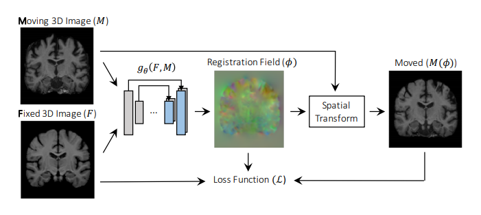

# Deep Deformable Registration



Deformable registration is basically calculation a dense vector field 
or mapping for every pixel in moving image to fixed image. This is better
suited for deeplearning based registration compared to estimation of 
transformation matrix end to end. Voxelmorph have model creation classes
for deformable registration learning. 

Here is the medium page for this repo
[Deep Deformable Registration](https://jerin-electronics.medium.com/deep-deformable-image-registration-6b96a7c81765)


If you are looking for non deformable registration, checkout
[Keypoint and ECC based registration](https://github.com/jerinka/Image_Registration)

For demo of supervised learning of transform matrix,
[registerNet](https://github.com/jerinka/registerNet)

[More on Voxelmorph](https://github.com/learn2reg/tutorials2019/blob/master/slides/Learn2reg_tutorial_unsupervided_AdrianDalca.pdf)


# Clone
```git clone https://github.com/jerinka/voxelmorph_demo```

## Click Star
Next step is to click on that star button in right top of this repo :grinning: Thank you.

# Install
```virtualenv venv3 --python=python3```\
```source venv3/bin/activate```\
```pip3 install -r requirements.txt```

# MNIST Register Demos

## Using voxelmorph class (Preferred)
```python3 simple_voxelmorph.py```

## From scratch demo in tf
```python3 register_basics.py```

## Detailed code from voxelmorph tutorial
```python voxelmorph_tutorial.py```

## Even more detailed tutorial notebook!
```jupyter notebook```
```VoxelMorph_Tutorial.ipynb```

# Real world demo!

## TODO


